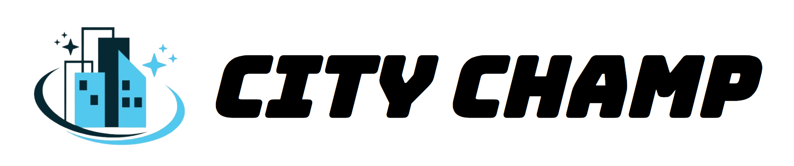

---

 

### 😎 Combining mixed reality gaming with onchain 3D scanning 🤳🏻🌐

City Champ is a mixed reality first-person combat, tower defense game developed for Meta Quest 3 using [Unity](https://unity.com/) and the [Solana SDK](https://github.com/magicblock-labs/Solana.Unity-SDK).

- As a player, defend your city 🏙️ from ghoulish creatures 👾 borne from urban social problems. Blast enemies, defend the *city core*, and collect reforms to win.
- As a builder, design new levels using 3D scans from across your city to challenge your peers.
- As a scanner, scan the meshes for new play areas using your phone's built-in LiDAR scanner to add endless level location possibilities.

 

### 👨🏻‍💻 Roles 🦸🏻‍♀️

#### For players 🎮: (outdoor AR or indoor VR)

1. Go to any location in your city where a game level has been created.
2. Choose the level that you want and pay a small amount in CityChamp tokens to play.
3. Beat the level by collecting all the reforms that spawn in the play area, while blasting enemies and defending the *city core* from damage. Pick up stat boosts to help you in your battle.
4. Earn achievements and collectables for winning!

#### For builders 🛠️: (indoor, MR headset)

1. Choose any scanned area and pay a small amount in CityChamp tokens to use it for your game level.
2. Design the level by placing enemies, weapons, and stat boosts to spawn around the play area.
3. Submit your level and earn CityChamp tokens every time someone plays it!

#### For scanners 📱: (outdoor, mobile)

1. Explore your local city to discover cool locations for AR content.
2. Scan the areas using a mobile scanning app, such as Polycam, Luma AI, or Scaniverse.
3. Send your scans to the MeshMap blockchain and earn tokens!
4. Earn achievements and collectables for scanning new areas!

 

### 🪙 How it works 🗺️

- Connect your Solana wallet or automatically generate a new wallet.
- The game is split into two play modes: Outdoor AR and Indoor VR.
- Scanning is only available in Outdoor AR. Building is only available in Indoor VR.
- Upload mobile 3D scans and mint them on the MeshMap blockchain. Scans and their original geotagged data are stored together.
- Earn $MESH or CityChamp tokens for scanning new areas.
- Earn $MESH or CityChamp tokens when your scans are used by others.
- Spend CityChamp tokens to use scans in your levels.
- Spend CityChamp tokens to play levels.
- Earn CityChamp tokens when your levels are played.

 

### 🔗 Creating a decentralized 3D mesh of the world on blockchain 🌐

Mixed reality content creation is a wide open market. The 3D mapping industry is also primed for disruption. With City Champ, we can ship a game that makes scanning a decentralized 3D world map fun and rewarding.

Our goal for City Champ—in addition to being as fun as possible—is to bootstrap an ambitious moonshot 🚀 product, **MeshMap**: a Solana DApp for scanning, geotagging, minting, and mapping a decentralized 3D mesh of the world.

Urban AR games and experiences like City Champ that integrate with MeshMap would function as a loosely connected network of AR creator platforms, facilitating an explosion in growth of AR content.

Furthermore, companies and governments could use MeshMap for large projects in urban planning, transportation, construction, disaster prevention and response, and other cases where spatial data is valuable.

 

### 👓 Appendix

Find out more about our studio's [related projects](https://www.spectracities.com/projects/) 🧰 and message us on our [Discord](https://discord.gg/aTSRjCaWvn) to get involved 🤝.
